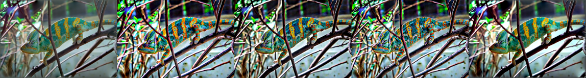
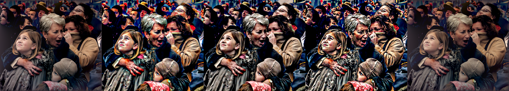
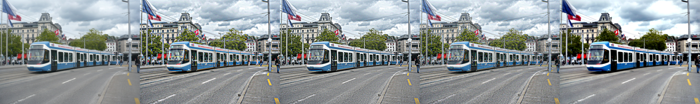
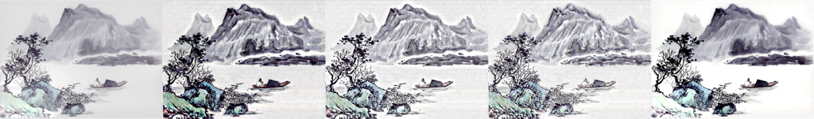
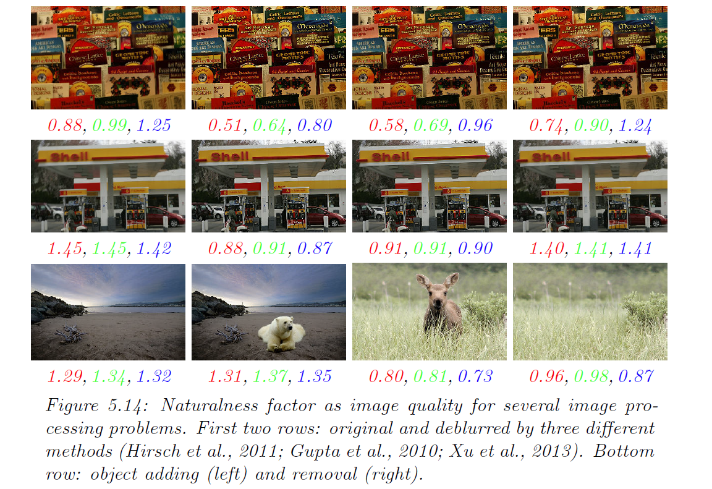

```
@phdthesis{gong:phd,
  title={Spectrally regularized surfaces},
  author={Gong, Yuanhao},
  year={2015},
  school={ETH Zurich, Nr. 22616},
  note={http://dx.doi.org/10.3929/ethz-a-010438292}}
  
@ARTICLE{gong:gdp, 
author={Gong, Y. and Sbalzarini, I.F.}, 
journal={Selected Topics in Signal Processing, IEEE Journal of}, 
title={A Natural-Scene Gradient Distribution Prior for Light-Microscopy Image Processing}, 
year={2015}, 
volume={PP}, 
number={99}, 
pages={1-1}, 
keywords={Economic indicators;Histograms;Image reconstruction;Microscopy;Parametric statistics;Gradient distribution;deconvolution;dehazing;denoising;naturalization;noiselevel estimation;parametric prior;variational method}, 
doi={10.1109/JSTSP.2015.2506122}, 
ISSN={1932-4553}, 
month={Dec},}

@conference{Gong:2014a,
	Abstract = {We propose to use gradient distribution specification for image en- hancement. The specified gradient distribution is learned from natural-scene im- age datasets. This enhances image quality based on two facts: First, the specified distribution is independent of image content. Second, the distance between the learned distribution and the empirical distribution of a given image correlates with subjectively perceived image quality. Based on those two facts, remapping an image such that the distribution of its gradients (and therefore also Laplacians) matches the specified distribution is expected to improve the quality of that im- age. We call this process ``image naturalization''. Our experiments confirm that naturalized images are more appealing to visual perception. Moreover, ``natural- ness'' can be used as a measure of image quality when ground-truth is unknown.},
	Address = {Singapore},
	Author = {Yuanhao Gong and Ivo F. Sbalzarini},
	Booktitle = {In Proc. Workshop "Emerging Topics in Image Enhancement and Restoration", 12th Asian Conference on Computer Vision},
	Date-Added = {2014-12-12 11:57:29 +0000},
	Date-Modified = {2015-04-16 10:03:11 +0000},
	Month = {Nov},
	Pages = {w7-p3},
	Title = {Image Enhancement by Gradient Distribution Specification},
	Year = {2014}}
```

# Naturalization = Enhancement + Quality Assessment
__paper__ and __souce code__ can be found at {http://mosaic.mpi-cbg.de/?q=downloads/naturalization}
## Image Enhancement 
From left to right: original image, Adaptive Manifold, Guided Filter, Relative Total Variation, Naturalization
*** 





## Image Quality Assessment
__naturalization factor__ can be used to indicate image quality. Details can be found at {http://mosaic.mpi-cbg.de/?q=downloads/naturalization}

## Noise Level Estimation
__paper__ and __souce code__ can be found at {http://mosaic.mpi-cbg.de/?q=downloads/naturalization}

