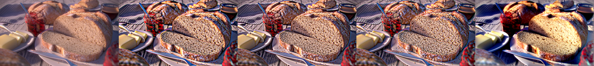
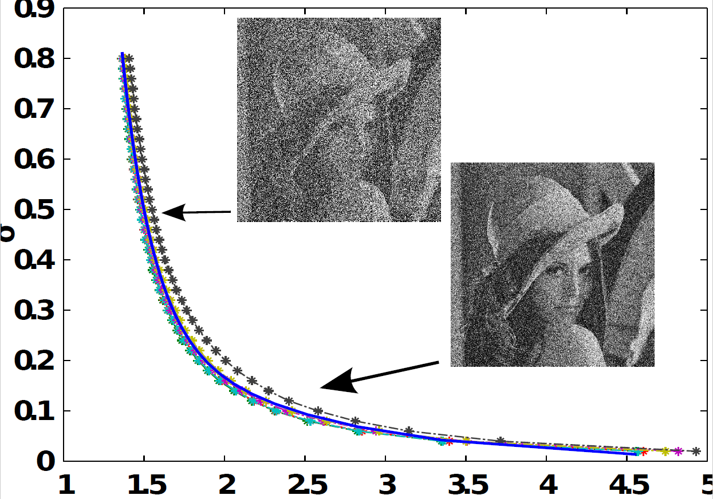

# Naturalization = Enhancement + Quality Assessment
__paper__ and __souce code__ can be found at {http://mosaic.mpi-cbg.de/?q=downloads/naturalization}
## Image Enhancement 
From left to right: original image, Adaptive Manifold, Guided Filter, Relative Total Variation, Naturalization
*** 

## Image Quality Assessment

## Noise Level Estimation
__paper__ and __souce code__ can be found at {http://mosaic.mpi-cbg.de/?q=downloads/naturalization}

